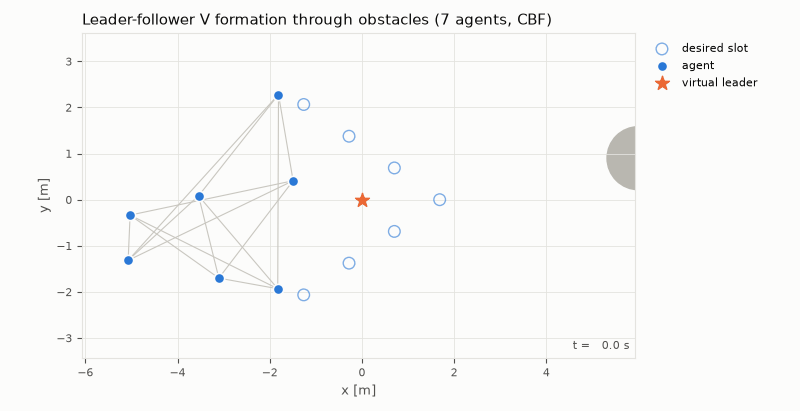
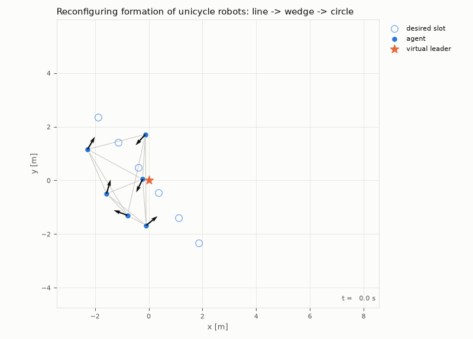
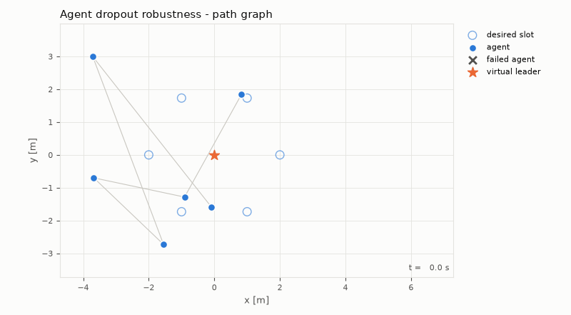
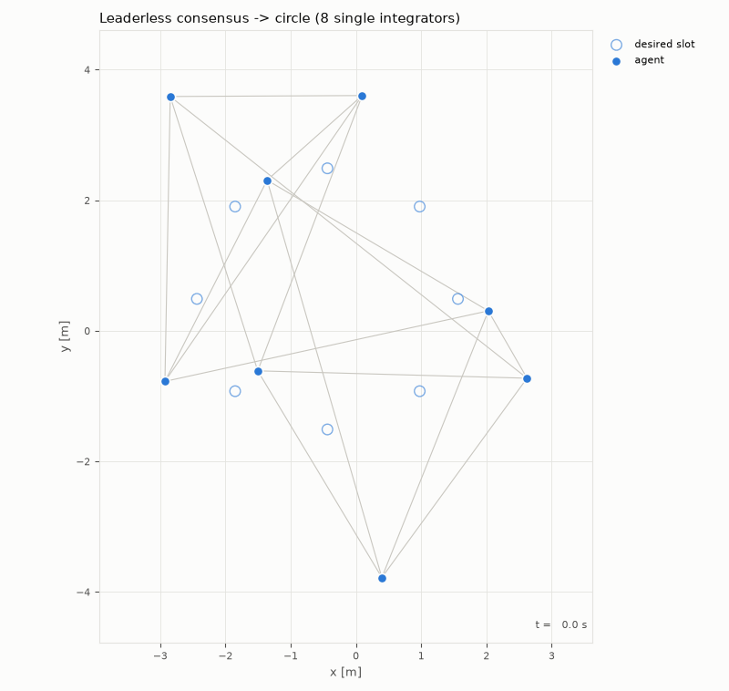
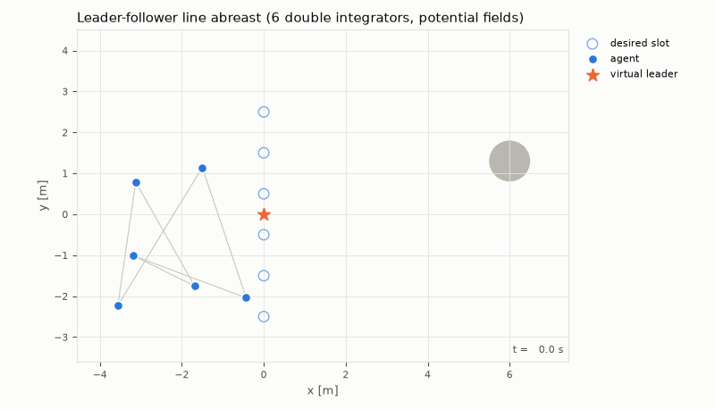
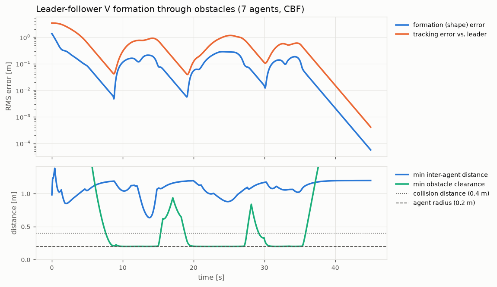
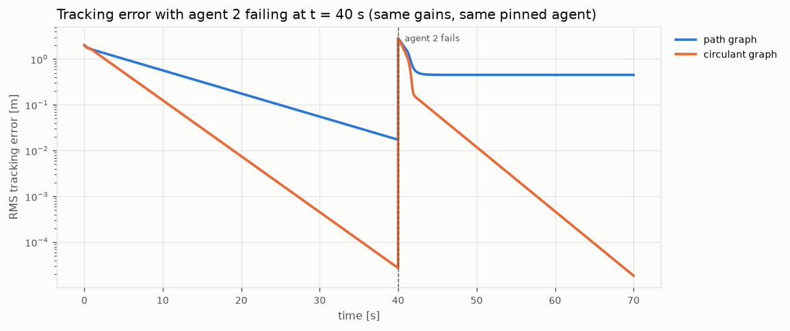

# Multi-Agent Formation Control Simulator

**Status:** Personal project (independent, not client work)



## Problem

A group of robots (drones, ground vehicles, warehouse AMRs) often has to move
*together*: keep a shape, follow a route, avoid obstacles and each other, and keep
working if one robot fails. Each robot only talks to a few neighbours, so there is
no central computer telling everyone where to go.

This project is a simulation tool for designing and checking that kind of
coordination before it goes on real hardware. It answers questions like *"will this
team hold formation?"*, *"how fast does it recover after an obstacle?"* and *"what
happens to the rest of the team when robot 2 dies?"* with plots and numbers, not
just animations.

It is the kind of simulation and control-law prototyping I do for robotics and
multi-agent systems work, and it builds directly on my PhD research
(formation control of multi-agent systems, IIT Delhi).

## Approach

**Agent models** (`dynamics.py`): single integrator, double integrator, and the
nonholonomic unicycle. The unicycle is controlled through the near-identity
(hand-position) transform, which makes a point a distance `l` ahead of the axle exactly
fully actuated, so the same formation law drives it (Lawton, Beard & Young, 2003).

**Interaction graph** (`graph_topology.py`): path, cycle, star, complete and circulant
graphs; Laplacian `L = D − A`, algebraic connectivity, connected components, and the
pinned matrix `L + B`.

**Formation laws** (`control_laws.py`), displacement-based, with `ξᵢ = pᵢ − rᵢ(t)`:

- First order: `uᵢ = ṙᵢ + ṗ_L − k [ Σⱼ aᵢⱼ(ξᵢ − ξⱼ) + bᵢ(ξᵢ − p_L) ]`
  - leaderless consensus when `B = 0`: the swarm agrees on its own formation centre
  - leader-follower when some agents are pinned (`bᵢ > 0`) to a virtual leader. The
    tracking error obeys `ė = −k(L + B)e`, which is exponentially stable for a connected
    graph with at least one pinned agent, with rate `k·λ_min(L + B)`
- Second order (double integrator): the same structure with position and velocity
  consensus (`kp`, `kv`). Along each eigenvalue λ of `L + B` the error dynamics are
  `s² + kv·λ·s + kp·λ`, which is Hurwitz for all `kp, kv > 0`.

The tests check these claims numerically. For example, the simulated tracking error
never exceeds the analytic bound `e^(−kλ_min t)‖e(0)‖`.

**Formation references** (`formations.py`): line, column, wedge (V) and circle shapes.
They can rotate with the leader's heading and blend smoothly (C¹) from one shape to the
next. Slots are assigned to agents with the Hungarian algorithm to minimise total travel,
so agents don't have to cross through each other. When an agent fails, the survivors
re-space into a full shape.

**Collision and obstacle avoidance** (`avoidance.py`):

- *Control-barrier-function (CBF) safety filter.* Each agent minimally changes its
  command so that `ḣ ≥ −γh` holds for every nearby agent and obstacle (decentralised,
  with agent-agent responsibility split equally; Wang, Ames & Egerstedt, 2017). The
  per-agent quadratic program is 2-D, so it is solved **exactly** by enumerating the
  candidate active sets. There is no solver dependency, and the tests check it against
  brute force. For unicycles, the safety radius is inflated by `l` so that keeping the
  controlled point safe also keeps the physical body safe.
- *Artificial potential fields* (Khatib-style repulsion). They work with any dynamics
  order, but they have local minima, and one scenario deliberately shows this.

**Simulator** (`simulate.py`): fixed-step RK4 with a zero-order-hold input, command
saturation, and scheduled agent failures. A failed agent freezes, drops out of the graph
and the formation, and stays in the arena as an obstacle.

## Tech stack

- Python 3.12
- NumPy (dynamics, linear algebra, vectorised simulation)
- SciPy (Hungarian assignment via `linear_sum_assignment`)
- Matplotlib + Pillow (plots and GIF animation; no ffmpeg needed)
- pytest (46 tests)

## Demo

| Reconfiguring unicycles: line → wedge → circle | Agent failure on a path graph |
|---|---|
|  |  |

| Leaderless consensus → circle | Line abreast with potential fields |
|---|---|
|  |  |

The trajectory and error plots for every scenario are in [`media/`](media/), for
example [`wedge_trajectories.png`](media/wedge_trajectories.png) and
[`wedge_errors.png`](media/wedge_errors.png).



## Results

Every number below comes from `media/results.json`, produced by
`scripts/run_all.sh` (Python 3.12.13, versions pinned in `requirements.txt`). These
are **simulation results for a prototype**, not hardware experiments. Agents are
disks of radius 0.2 m, so a collision would mean centres closer than 0.4 m. "Converged"
means RMS error below 5 cm.

| Scenario | Agents / model | Converged (RMS < 5 cm) | Final error | Min agent–agent distance | Min obstacle clearance* |
|---|---|---|---|---|---|
| Circle, leaderless consensus, CBF | 8 × single integrator | shape at **2.77 s** (from 1.55 m) | 6 × 10⁻⁹ m | 0.861 m | – |
| V formation through 3 obstacles, CBF | 7 × single integrator | tracking at **8.46 s** (from 3.43 m); settled for good at 38.4 s | 4.1 × 10⁻⁴ m | 0.636 m | **0.200 m** |
| Line → wedge → circle on a curved path, CBF | 6 × unicycle | tracking at **8.09 s**, and stays below 5 cm through both reconfigurations | 2.0 × 10⁻⁴ m | 0.786 m | – |
| Line abreast past 2 obstacles, potential fields | 6 × double integrator | tracking settled at **39.9 s** | 0.029 m | 0.825 m | 0.471 m |

\*Clearance is measured from the robot's centre to the obstacle surface, so it must stay
≥ 0.2 m (the agent radius).

- **No collisions in any run, and no infeasible CBF problems.** In the V-formation run
  the filter intervened 3,866 times (agent-steps) and held obstacle clearance at
  0.200046 m, right on the safety boundary, as a CBF is designed to.
- **The V formation deforms and recovers.** Passing the obstacles, tracking error peaks at
  1.17 m (t = 25.2 s) and then falls back below 5 cm.
- **The potential-field local minimum shows up exactly as expected.** In the line
  scenario, agent 4's slot lies directly behind an obstacle. It stays within 15 cm of
  x = 5 m from t = 11.6 s to t = 19.1 s, and consensus drags the rest of the team back
  with it (tracking error peaks at 1.65 m). That is why the obstacle-heavy scenarios use
  the CBF filter instead.
- **Speed:** each scenario (15–45 s of simulated time) runs in 0.3–1.5 s of wall-clock
  time on a laptop CPU.

### Robustness to agent loss



Six agents follow a moving virtual leader in a circle, with only agent 0 pinned. The
initial state, gains and pinning are identical in both runs; only the communication
graph changes. Agent 2 fails at t = 40 s.

| | Path graph (chain) | Circulant graph (2 neighbours per side) |
|---|---|---|
| λ_min(L + B), which sets the convergence rate | 0.058 | 0.140 |
| Time to converge before the failure | 30.9 s | 13.3 s |
| Graph after agent 2 fails | splits into {0, 1} and {3, 4, 5}; {3, 4, 5} has no link to the leader | stays connected |
| Recovery after the failure | **never**: tracking error is still 0.45 m at t = 70 s | **5.6 s** to get back below 5 cm |

Takeaway for a real system: the choice of who talks to whom decides both how fast the
team converges and whether it survives losing a member. That can be analysed from the
graph (`λ_min(L + B)`, cut vertices) before building anything.

## How to run

```bash
git clone https://github.com/soumics/formation-control-swarm-sim.git
cd formation-control-swarm-sim
python3 -m venv .venv && source .venv/bin/activate
pip install -r requirements.txt        # also installs this package (editable)

pytest -q                               # 46 tests
python examples/run_formation_demo.py   # all 4 scenarios -> media/*.png, *.gif, results.json
python examples/run_dropout_study.py    # path vs circulant failure study
# or everything at once:
bash scripts/run_all.sh
```

Useful options:

```bash
python examples/run_formation_demo.py --scenario wedge --no-gif   # one scenario, figures only
python examples/run_formation_demo.py --scenario circle --show    # open interactive windows
```

To build your own scenario, combine a dynamics model, a graph, a `FormationReference`
and a controller in a `Simulation` (see `src/formation_sim/scenarios.py` for
worked examples).

## What I'd extend for a real client engagement

- **Your robots and constraints:** your robot's actual dynamics (e.g. quadrotor,
  car-like/Ackermann, marine vessel), actuator limits, sensing range, and communication
  delays or packet loss.
- **Moving to real software:** a ROS 2 node per robot, validated in Gazebo or Isaac
  Sim, then on hardware.
- **Stronger safety guarantees:** higher-order CBFs for acceleration-controlled robots,
  deadlock resolution, and CBF filters that stay safe under input limits.
- **Automated design studies:** Monte-Carlo sweeps over initial conditions, gains and
  failure patterns, with a report showing which graph and gains meet your
  convergence-time and safety requirements.
